# Practica: Ejercicios de logica con estructuras no lineales: arboles

## Datos del Estudiante
- **Nombre:** Ricardo Emilio Uzhca Benavides
- **Curso:** Grupo 1
- **Fecha:** 22/06/2026

---

**Ejercicio 1**
Insertar en BST: Este ejercicio dice que debemos guardar varios numeros dentro del arbol, los menores a la izquierda y mayores a la derecha y luego mostramos como quedo el arbol

Explicacion del metodo: Se crea el arbol vacio luego se recorren los numeros del arreglo, se agrega al arbol y se imprime el arbol completo

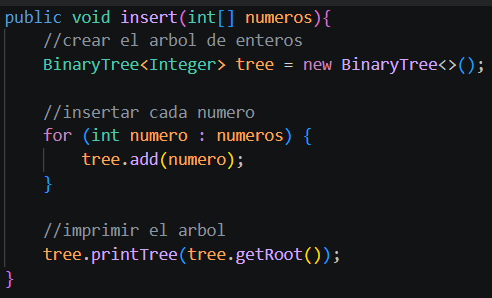

Implementacion en el App.java:

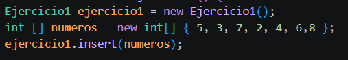

Salida en consola del Ejercicio 1:

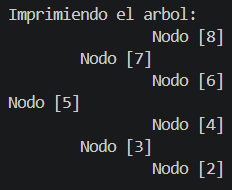

---

**Ejercicio 2**
Invertir arbol binario: En este ejercicio se cambia de lugar a los hijos de cada nodo al final queda como si se reflejara el arbol.

Explicacion del metodo: Primero invertimos el arbol original luego intercambiamos los hijos izquierdo y derecho repitiendo todo esto en los nodos usando recursividad.

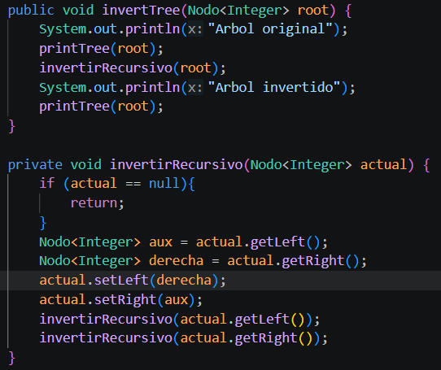

Implementacion en el App.java:

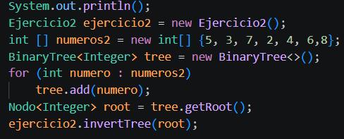

Salida en consola del Ejercicio 2:

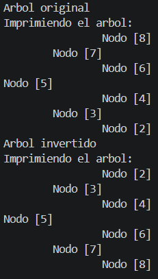

Para estos 2 ejercicios se reutilizo el codigo de un metodo para imprimir los arboles:

Para mostrar el arbol de forma horizontal y ver como quedaron acomodados los nodos utlizamos recursividad para recorrer todo el arbol

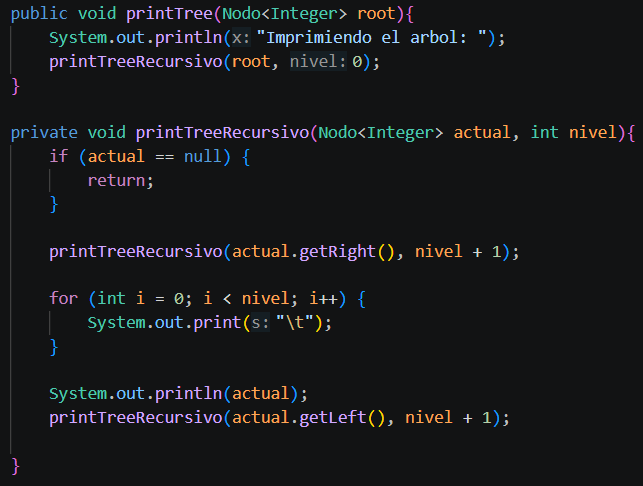

---

**Ejercicio 3**
Listar niveles: Aqui hay que separar los nodos segun el nivel en el que estan, los que esten a la misma altura se guardan juntos en una lista

Explicacion del metodo: Se crea una cola para recorrer al arbol desde la raiz e ir viendo los nodos nivel por nivel y cada nivel se guarda en diferentes listas y luego se devuelve toda la lista de los niveles

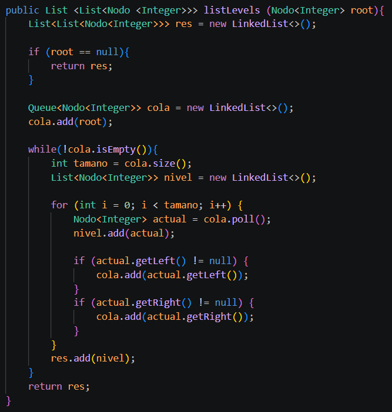

Implementacion en el App.java:

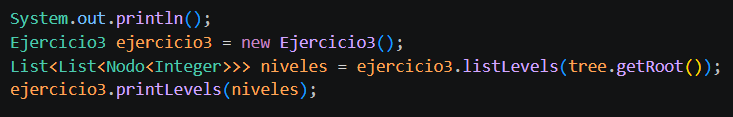

Salida en consola del Ejercicio 3:

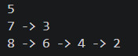

Para este ejercicio se utilizo otro metodo diferente para imprimir como una lista enlazada:

Que recorre cada nivel del arbol e imprime los valores de los nodos y les pone una flecha para los que esten en el mismo nivel y se salta una linea al acabar uno

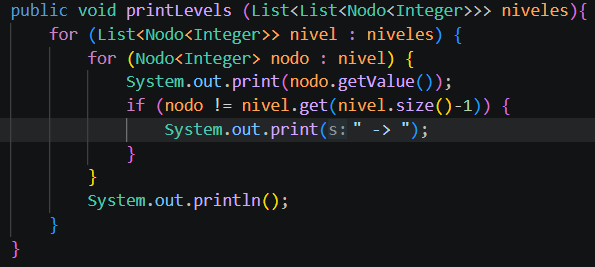

---

**Ejercicio 4**
Profundidad maxima: Este ejercicio dice cual es el camino mas largo desde la raiz hasta una hoja del arbol, la cantidad de nodos de este camino es la profundidad maxima

Explicacion del metodo: Si el nodo es nulo, devuelve 0 luego calcula la profundidad de izquierda y derecha, toma la mayor y suma 1 por el nodo actual y devuelve un resultado

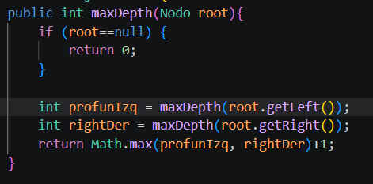

Implementacion en el App.java:

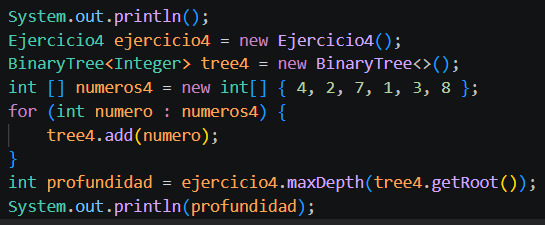

Salida en consola del Ejercicio 2:

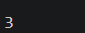